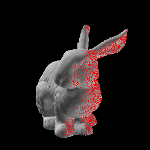
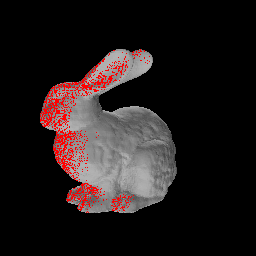

This repository is supposed to have prmitives for 3D vision. The goal is to have atomic objects and functions that allow quick and easy visualization of concepts. This is supposed to be a growing project, where I add more functionality as I learn more things.

### Current Functionality

- A 3D mesh renderer with basic flat lighting. 
- A wireframe rendered
- A script to create a synthetic dataset for SfM

### Creating a dataset

Look at the script `scripts/create_dataset.py`. Given a `.obj` file, takes images in a ring around the object, saving metatdata like camera parameters and GT correspondences.

Parameters that can be manipulated
- Lighting Directions and Strength
- Camera Parameters

Make the necessary adjustments to the `DatasetConifg` dataclass in the script and run it, for each view, you get an image, camera matrix, and labels for each pixel. 

Here is an example visualization of two views and the GT correspondences based on the geometry.

 

